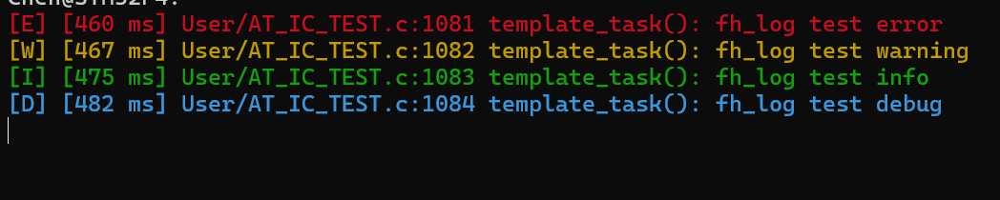

<!--
 * @Author: ischen.x ischen.x@foxmail.com
 * @Date: 2025-08-08 11:11:04
 * @LastEditors: ischen.x ischen.x@foxmail.com
 * @LastEditTime: 2025-08-11 10:45:05
 * 
 * Copyright (c) 2025 by fhchengz, All Rights Reserved. 
-->
# fh_log

一个轻量级、可移植的 C 语言日志模块，支持彩色输出、日志等级、时间戳自定义，适用于嵌入式和桌面开发。



## 特性

- 支持日志等级（ERROR/WARN/INFO/DEBUG）
- 支持 ANSI 彩色输出（可在串口终端、部分IDE终端显示）
- 支持自定义输出函数（如串口、文件、网络等）
- 支持自定义时间戳函数
- 线程安全由用户输出函数保证

## 快速开始

### 1. 添加文件

将 `fh_log.c`、`fh_log.h` 添加到你的工程。

### 2. 实现输出函数和时间戳函数

```c
// 例：串口输出
void uart_send_str(const char *str) {
    // 用户实现：通过串口发送字符串
}

// 例：获取毫秒时间戳
uint32_t log_time(void) {
    return HAL_GetTick(); // 或其他获取ms时间戳的函数
}
```

### 3. 初始化日志系统
```c
#include "fh_log.h"

log_init(uart_send_str, log_time);
```

### 4. 使用日志宏
```c
LOGE("错误信息: %d", err_code);
LOGW("警告信息");
LOGI("普通信息");
LOGD("调试信息: var=%d", var);
```

## 配置
- 支持日志等级（ERROR/WARN/INFO/DEBUG）默认日志等级为 LOG_DEBUG，可在编译时通过 -DLOG_LEVEL=LOG_INFO 等方式修改。
- 支持日志等级（ERROR/WARN/INFO/DEBUG）颜色输出可在终端或串口工具中查看（需支持ANSI转义）。
